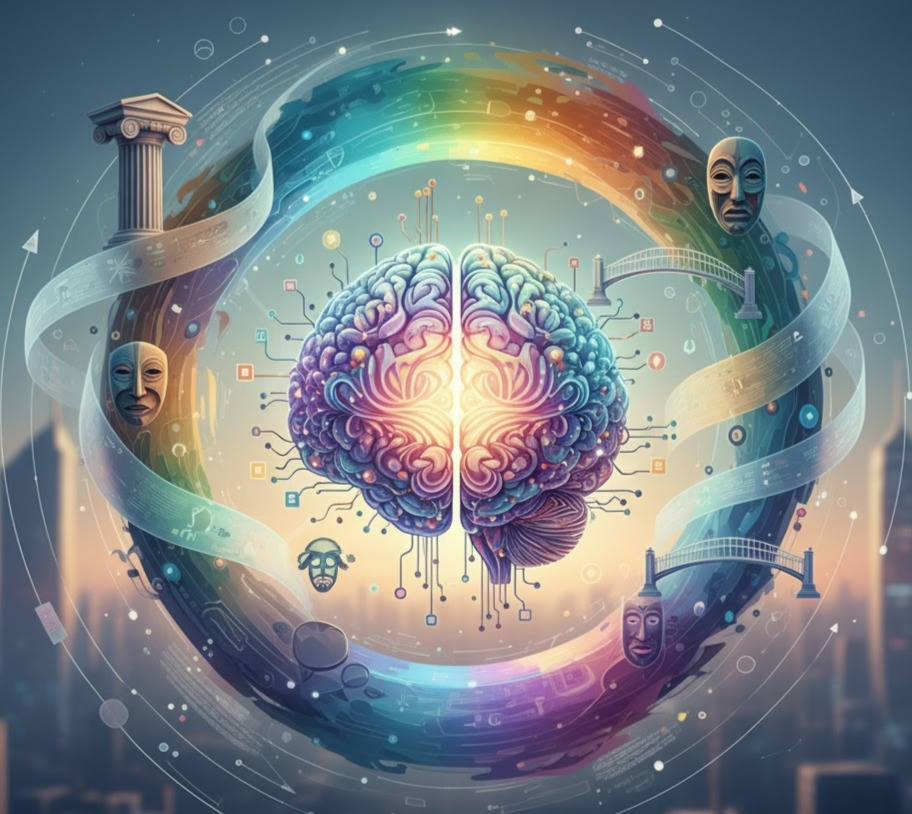

<div align="center">



<p></p>

<h1>News Synapse</h1>

<h2>
BGI Hackathon 2025
</br></br>
🥈 2nd Place in the Decentralized News & Media Integrity Track
</h2>

</div>

Designed to build an expansive rather than retracting collective imagination, this agent aims to enrich public discourse by complexifying news and media while countering social polarization and binary thinking.

The agent is designed to detect and amplify content and news that transcend ideological polarization, promoting nuanced thinking and exploring the gray areas, with the goal of bringing minds closer together rather than driving them apart. The agent curates cultural content that fosters complex, non-dual thought, challenges stereotypes, and builds bridges between cultures. It is trained with the works of high-level authors and philosophers who question simplistic paradigms and confront the status quo from hegemonic media, while being equipped to detect and filter hateful, racist, or misogynistic language.

## Special Characteristics

### **Philosophical Perspective Integration**
The agent applies perspectives from 16 carefully selected thinkers:

- **Classic Foundational**: Socrates, Nietzsche, Kierkegaard
- **Modern Contemporary**: Foucault, Butler, West, Barthes, Derrida, Deleuze  
- **Radical Critical**: Freire, bell hooks, Adorno, Benjamin
- **Literary Philosophical**: James Baldwin, Toni Morrison, Todorov
- **Science & Futurism**: Donna Haraway, Yuval Noah Harari

Each response automatically integrates multiple philosophical lenses to help you:
- Question underlying assumptions
- Examine power dynamics
- Consider multiple cultural perspectives
- Challenge binary thinking
- Build bridges between different worldviews

### **Offensive Language Detection & Alternative Suggestions**

The agent includes sophisticated detection for:

**Detected Categories:**
- Racist language and coded expressions
- Misogynistic and sexist language
- Homophobic and transphobic language
- Ableist language
- Classist expressions
- Xenophobic rhetoric

**Response Features:**
- **Real-time detection** with severity assessment (mild/moderate/severe)
- **Specific alternative phrasings** with concrete examples
- **Philosophical insights** to understand why certain language is harmful
- **Bridge-building suggestions** to reframe conversations constructively

### **Cultural Bridge Building**

The agent actively works to:
- **Challenge stereotypes** and cultural essentialisms
- **Build understanding** between different perspectives
- **Recognize cultural diversity** within and between groups
- **Address power dynamics** in intercultural encounters
- **Find common ground** while respecting differences

## How to Use Search Functionality

### **News Search Commands**

The agent can search for current news and articles when you use specific keywords:

**Trigger Phrases:**
- "Search news about [topic]"
- "Find stories about [topic]"
- "Show me news about [topic]"
- "Latest articles on [topic]"
- "Recent news on [topic]"

**Examples:**
```
User: "Search news about cultural bridges"
User: "Find stories about universities in Latin America"
User: "Show me latest articles on dialogue between cultures"
```

### **Search Parameters**

You can customize your search with:
- **Topic/Query**: What you want to search for
- **Time Range**: How many days back to search (default: 7 days)
- **Number of Stories**: How many articles to return (max: 5)

**Example:**
```
User: "Search news about immigration in the last 15 days, show me 3 stories"
```

### **News Response Format**

The agent provides:
- **Article Title** (with full formatting)
- **Complete URL/Link** for easy access
- **Publication Date**
- **Media Source Name**
- **Philosophical Analysis** from a bridge-building perspective


## Technical Features

### **Powered By:**
- **ASI1 AI Model** for natural language processing
- **MediaCloud API** for news search functionality
- **16 Integrated Philosophical Frameworks**
- **Advanced Pattern Detection** for problematic language
- **Cultural Bridge-Building Algorithms**

### **Response Capabilities:**
- Real-time offensive language detection
- Multi-perspective philosophical analysis
- Current news search and analysis
- Alternative framing suggestions
- Bridge-building strategies
- Cross-cultural understanding facilitation

## What Makes This Agent Unique

This agent doesn't just answer questions - it **transforms how you think about questions**. By integrating wisdom from diverse philosophical traditions and actively working to build understanding across differences, every interaction becomes an opportunity for intellectual and emotional growth.

Whether you're navigating cultural differences, trying to understand current events, or simply want to think more critically about the world around you, this agent serves as your philosophical companion and cultural bridge-builder.

---

*Remember: The goal isn't to be "politically correct" but to think more clearly, question assumptions, and build genuine understanding across differences.*